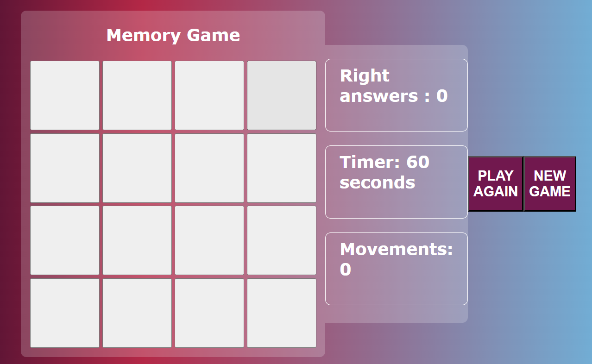

<h1 align="center">Memory Game</h1>                                      

This project is an exercise for practising and improving javascript and css skills, with personal additions as the "Play again" and "New game" buttons. 

During this project  I have learnt more about the structure of arrow functions and special functions such as: 

- setInterval(() => {})
- setTimeout(() => {}, 1000)

Besides I have found very useful the method window.location.reload() to reload the page.

**[Visit my website](https://martinamicaela.github.io/memorygame/)**

### SUPERUSER CREDENTIALS:  
- username - heroku_admin 
- password - 1a2d3m4i5n
  
These will be needed to access some features of the site.

# Overview

The website targets vulnerable and underserved youth, offering a platform for lifelong skill development similar to Boys and Girls Scouts. My mission is to expand events into an online hub where participants earn badges by mastering skills, fostering interaction, and applying abilities to life challenges. Youth aged 6-18 can transition and grow in a safe space. 
The age limit of 18 years old aligns with the legal definition of adulthood in the USA, which is why it's applicable for the websites purposes.

The name iCreate embodies the boundless potential within each individual child to shape their own reality, transcending limitations imposed by environment or resources. It stands as a powerful affirmation of personal empowerment, urging individuals to craft their unique selves without constraints.

It's important to note that while this project is currently developed solely for educational purposes, it will be further developed for future use by my children and for volunteer work with youth through an established organisation.

# Table of Contents

1. [UX](#ux)
    - [User Stories](#user-stories)

2. [Scope](#scope)
    - [Features](#features)
    - [Future Features](#future-features)

3. [Structure](#structure)

4. [Wireframes](#wireframes)

5. [Database schema](#database-schema)

6. [Surface](#surface)

7. [Technologies Used](#technologies-used)

8. [Testing](#testing)

9. [Deployment](#deployment)

10. [Credits](#credits)

#
# UX

Applying fundamental UX principles, I initially focused on devising a strategy by identifying the target audience and determining the features that would offer them the most value.

The target audience for 'iCreate Youth' includes:

- Youth aged 6-18 years old, aiming to engage them in constructive and educational activities.
- Individuals seeking to explore their creativity and develop new skills.
- Vistors looking for opportunities to participate in events and workshops relevant to their interests.
- Guardians interested in providing their children with enriching experiences and learning opportunities.

These users will be looking for:

- An engaging and interactive website tailored to their age group.
- Opportunities to explore various interests and hobbies through workshops and events.
- A platform where they can register for events and courses easily.
- Features to track their progress and achievements, such as earning badges or certificates.
- A user-friendly interface with intuitive navigation to access content and resources.
- The ability to post, comment and like events an provide feedback reviews.
- Functionality to manage their registrations, including canceling or rescheduling participation as needed.

This website will provide all of these features while ensuring a safe and supportive online environment for youth to 
learn, explore, and grow. Additionally, it will incorporate CRUD functionality to allow administrators to manage workshops, courses, registrations, and user data effectively.

## User Stories

**Epic: Admin**
| ID  | Content                                                                                                                               |
| --- | --------------------------------------------------------------------------------------------------------------------------------------|
| 1   | As a site Admin I can create, edit and delete events and comments so that I can manage the site content.                              |
| 2   | As a site Admin I can access the admin panel so that I can manage events and comments.                                                |
| 3   | As a site Admin I can log out of the admin panel so that I can disconnect from the website.                                           |
| 4   | As a site Admin I prioritise implementing measures to safeguard youth data and ensure compliance with privacy                         |
|     | regulations, demonstrating our commitment to protecting user information                                                              |
| 5   | As a site Admin I prioritise the inclusion of diverse and inclusive content on the website, ensuring that resources,                  |
|     | events, and services cater to the varied needs and backgrounds of our youth population, promoting accessibility and equity.           |
| 6   | As a site Admin I seek to establish partnerships with local teachers, therapists, and licensed professionals to expand the range of.  | 
|     | services and resources available to youth on our platform, enriching the overall wellness experience and promoting collaboration      | 
|     | within the iCreate hub.                                                                                                               |

**Epic: User Interaction**
| ID  | Content                                                                                                                               |
| --- |---------------------------------------------------------------------------------------------------------------------------------------|
| 1   | As a logged-in User I can attend events so that I can join events easily using a simple button.                                       |
| 2   | As a logged-in User I can delete attend events so that I can change my mind to attend events easily using a simple button.            |
| 3   | As a logged-in User I can create reviews on events so that I can leave my feedback.                                                   |
| 4   | As a logged-in User I can read reviews on events so that I can leave my feedback.                                                     |
| 5   | As a logged-in User I can update reviews on events so that I can change my feedback.                                                  |
| 6   | As a logged-in User I can delete reviews on events so that I can remove my feedback.                                                  |
| 7   | As a logged-in User I can like and unlike events so that I can mark which events I like.                                              |
| 8   | As a User I can view the number of likes on events so that I can see which events are the most popular.                               |
| 9   | As a User I can view comments on events so that I can read other users opinions.                                                      |

**Epic: User Events**
| ID  | Content                                                                                                                                               |
| --- |-------------------------------------------------------------------------------------------------------------------------------------------------------|
| 1   | As a young user, I want to explore captivating event details presented on flip cards, so that I can click on the "View Details" button for more.      | 
|     | information.                                                                                                                                          |
| 2   | As a logged-in User I can post a event so that other users can see them to sign up.                                                                   |
| 3   | As a User I can delete my events so that I can remove any unwanted events that I have made.                                                           |
| 4   | As a User I can edit events so that I can update any changes or mistakes to my events.                                                                |
| 5   | As a logged-in User I can upload an image along with my event so that other users can see an image relating to the event.                             |

**Epic: Login/Register**
| ID  | Content   
| --- |-------------------------------------------------------------------------------------------------------------------------------------------------------|
| 1   | As a User I can register for an account so that I can interact with the site content.                                                                 |
| 2   | As a User I can log in/out off my account if I wish so that I can connect or disconnect from the website.                                             |
| 3   | As a User I can easily see if I'm logged-in or logged-out so that I can be sure what my status is.                                                    |

**Epic: Navigation**
| ID  | Content   
| --- |----------------------------------------------------------------------------------------------------------------------------------------------------------|
| 1   | As a young user aged 6-18, I want the navigation of the iCreate platform to be designed with my needs in mind so that I can easily find and access the.  | 
|     | content I'm interested in.                                                                                                                               |
| 2   | As a young user aged 6-18, I want the navigation of the iCreate platform to work seamlessly on all devices, including smartphones and tablets, so that I |  
|     |can access the platform from anywhere.                                                                                                                    |
| 3   |As a young user aged 6-18, I want the navigation menu of the iCreate platform to be organised into clear categories like Events, About, Resources, Login, | 
|     |Logout so that I can quickly navigate to the content I want to explore.                                                                                   |
| 4   | As a young user aged 6-18, I want the navigation of the iCreate platform to use engaging visuals, icons, and colours to make it visually appealing and   | 
|     | attractive to me.                                                                                                                                        |
| 5   | As a young user aged 6-18, I want the navigation elements of the iCreate platform to be consistent across different pages so that I can easily understand| 
|     | and navigate the website.                                                                                                                                |
| 6   | As a young user aged 6-18, I want the navigation of the iCreate platform to be accessible to users with disabilities, including features like keyboard.  | 
|     | navigation and screen reader compatibility, so that all users can use the platform effectively.                                                          |

### MoSCoW Prioritisation

I broke down my Epics into stories before prioritising and implementing them.
By following this method, I applied MoSCoW prioritisation and labels to my user stories within the Issues tab.

- **Must Have**: guaranteed to be delivered (*max 60% of stories*)
- **Should Have**: adds significant value, but not vital (*the rest ~20% of stories*)
- **Could Have**: has small impact if left out (*20% of stories*)
- **Won't Have**: not a priority for this iteration

#
# Scope 

## **Features**

### **Home Page**

1. **Navigation Bar**
   - The navigation bar appears on every page so users can easily navigate through the site.
   - Navigation bar has links for 'Home', 'About' and 'Login/Register' more links will be shown to logged in users.
   - If the user is logged in then the left side of the menu shows links for pages that only authorised users can visit. 
   - The user name will also appear on the bar, indicating which user is logged in.
   - The navbar is fully responsive, collapsing into a hamburger menu for medium and small screen size.

   

## Models
### **Event Model**

### **Reviews Model**

### **About Model**

### **SubmitDetails Model**

## Technologies Used

### Languages Used
- 
- 
- 

 ## Frameworks, Libraries & Programs Used

- - GitHub is a web-based platform for version control using Git, enabling collaborative software development and hosting of code repositories. GitHub connects to GitPod and Heroku. I used for secure online code storage.

-  – Connected to GitHub, GitPod hosted the coding space, allowing the project to be built and then committed to the GitHub repository. I used for version control. (`git add`, `git commit`, `git push`)

-  - Font Awesome is a library of scalable vector icons that can be easily customised and used to enhance the visual appeal of websites and applications. Imported to base.html.

-  - Beautify is a code formatter tool that automatically formats code to improve readability and consistency. Used in Gitpod to help color code and spot errors.

-  - Lucidchart is a web-based diagramming tool that allows users to create and collaborate on flowcharts, ERDs, and other visual representations of data and processes. Made a ERD flow chart.

-  - Am I Responsive is a web tool that allows users to quickly preview how their website appears on various devices and screen sises, helping to ensure responsiveness and compatibility across platforms. Put my heroku url to check responsivity to all devices.

-  - Diffchecker is a text comparison tool used to highlight the differences between two blocks of text, facilitating comparison and analysis. Update my code against old code for validation.

-  - The W3C CSS Validator is a tool used to check the validity and syntax of CSS code, ensuring compliance with web standards set by the World Wide Web Consortium (W3C). Import my CSS for validation.

-  - The W3C Markup Validator is a tool used to check the validity and syntax of HTML code, ensuring compliance with web standards set by the World Wide Web Consortium (W3C). Import my html for validation.

-  - JSHint is a static code analysis tool used for checking JavaScript code for errors, potential problems, and stylistic inconsistencies. Import my JS code for validation.

- - an open-source tool used for auditing web page quality, including performance, accessibility, SEO, and cross-browser testing. Check for validation.

# Testing 

## User Story Testing

## User Stories, features and bugs

<table>
  <tr>
    <th>User Story</th>
    <th>Features</th>
    <th>Bugs / Issues - tested all viewports using Google Dev Tools</th>
  </tr>
   <tr>
    <td>As a young user, I want to explore captivating event details presented on flip cards, so that I can click on the "View Details" button for more information.</td>
    <td>Interactive flip cards designed for children to rotate 180°.The front side displays event images to capture their interest. Back side displays details including a 'view details' button.</td>
    <td>The display would not flex to row.</td>
  </tr>
  <tr>
    <td>As a young user, I want to explore captivating event details presented on flip cards, so that I can click on the "View Details" button for more information.</td>
    <td>Interactive flip cards designed for children to rotate 180°. The front side displays event images to capture their interest. Back side displays details including a 'view details' button.</td>
    <td>The brief description overflowed flip cards</td>
   </tr>
   <tr>
    <td>As a logged-in User I can attend events so that I can join events easily using a simple button</td>
    <td>The button system displays attendees.. Organisers know who is attending.</td>
    <td>On event detail page attending button unresponsive</td>
   <tr>
    <td>As a logged-in User I can delete attend events so that I can change my mind to join events using a simple button</td>
    <td>Event view details page with event displayed. The button system displays cancelled attendees.</td>
    <td>Event system by attendees unresponsive. Organisers know who is cancelled attending.</td>
   </tr>
   <tr>
    <td>As a young user aged 6-18, I want the iCreate platform's navigation to be seamless across all devices, enabling me to access it from anywhere, including smartphones and tablets.</td>
    <td>Study my skills anywhere Easy mobile accessibility</td>
    <td>None detected.</td> 
   </tr>
  <tr>
    <td>As a Organiser I can create events so that users can attend them.</td>
    <td>Specify date, time, location, course or interest, and max. participants. List of users attending. Add an event picture.</td>
    <td>None detected</td>
    </tr>

  <tr>
    <td>As a user, I want the site to be easily navigable.</td>
    <td>Different features of site are clearly identifiable</td>
    <td>None detected</td>
    
  </tr>
  <tr>
    <td>As a site Admin I prioritise the inclusion of diverse and inclusive content on the website, ensuring that resources, 
  events, and services cater to the varied needs and backgrounds of our youth population, promoting accessibility and equity.</td>
    <td>Minililistic design Simple font and layout</td>
    <td>None detected</td>
    
  </tr>
  <tr>
    <td>As a User I can log in/out off my account if I wish so that I can connect or disconnect from the website.</td>
    <td>Success notifications to alert user</td>
    <td>None detected</td>
    
  </tr>
  <tr>
    <td>As a user, I want the site to be visually appealing.</td>
    <td>Blue: Calming, reduces stress, promotes relaxation, trust, stability for kids  Children enjoy flip cards because they offer interactive engagement and surprise through flipping actions, along with colorful and visually appealing designs.
    </td>
    <td>None detected</td>
</tr>
  </table>

 

### User Stories and Features (to be implemented next Sprint) 

  <table>
  <tr>
    <th>User Story</th>
    <th>Features</th>
    <th>Bugs / Issues</th>
  </tr>

  <tr>
    <td>As a user I want to able to search filter events so that I can attend events of my interest.</td>
    <td>Filter by category, words or interests.</td>
    <td>N/A</td>
  </tr>
  
  <tr>
    <td>As a user I can get notified of upcoming events so that I am less likely to miss or forget the event.</td>
    <td>Get notifications from upcoming events.</td>
    <td>N/A</td>
  </tr>

  <tr>
    <td>Implement a JavaScript mouseover sound feature, activating a flip card action to reveal the other side when hovering over or clicking the card at 180 degrees.</td>
    <td>Add to the fun experience for children</td>
    <td>N/A</td>
  </tr>

  <tr>
    <td>Award certificates and badges upon completing tasks and mastering skills on the platform so that I am motivated to continue learning and engaging with the platform's activities</td>
    <td>Motivate to continue learning and engaging with the platform's activities</td>
    <td>N/A</td>
  </tr>
  

  </table>

### Won't haves

  <table>
  <tr>
    <th>User Story</th>
    <th>Features</th>
    <th>Bugs / Issues</th>
  </tr>
  <tr>
    <td>As a user I want to be able to friend other users</td>
    <td>Add friend option.</td>
    <td>N/A</td>
  </tr>

## Fixed Bugs / Issues
 
<table>
  <tr>
    <th>Bug/Issue</th>
    <th>Image</th>
    <th>Resolution</th>
  </tr>
  <tr>
  <td>Back side flip card overflows card</td>
    <td></td>
    
  <td>Reduced text in admin</td>
  </tr>
  
  </table>

## Unfixed Bugs / Issues
<table>
  <tr>
    <th>Bug/Issue</th>
    <th>Image</th>
    <th>Resolution</th>
  </tr>
  <tr>
  <td>Ipad display is not centered on the screen using bootstrap</td>
    <td></td>
    
  <td>Due to time constraints, I could not address the slight misalignment of the Bootstrap responsiveness for iPad. I plan to rectify this in the next sprint.</td>
  </tr>
</table>

**EPIC: Superuser / Admin**
- As a site Admin I can create, edit and delete events and comments so that I can manage the site content
- As a site Admin I can access the admin panel so that I can manage events and comments
- As a site Admin I can log out of the admin panel so that I can disconnect from the website

This was tested by accessing the Django Admin Panel. By creating a Superuser I can access the Django Admin Panel where the administrator can perform all the CRUD functionalities.

**EPIC: User Interaction**
1. As a logged-in User I can write reviews on events so that I can leave my feedback

2. As a logged-in User I like

3. As a User I 

4. As a User I 

**EPIC: User Events**
1. As a logged-in 

2. As a User I 

3. As a User I  

4. As a logged-in User I 

**EPIC: Login/Register**
1. As a User

2. As a User I 

3. As a User my status is

**EPIC: Navigation**
1. As a User 

2. As a User 

### Validator Testing

# Testing 

Testing and results can be found [here](TESTING.md).

## Bugs and Issues
- 
- 
- 
- 
- 

# Deployment

# Credits

- [ChatGPT] (https://chat.openai.com) - Providing guidance whenever I encountered code I did not grasp.
- [DALL-E 3](https://openai.com/dall-e-3) - Converted all my textual ideas into visual images.
- [W3Schools](https://www.w3schools.com/howto/howto_css_flip_card.asp) - W3Schools provided me guidance on creating flip cards, which I incorporated into the website design.
- [CodingTube](https://www.youtube.com/watch?v=TMWkKPlUUJ4) - CodingTube gave me an opportunity to practice JavaScript concepts toggle flip cards and in this memory game tutorial.

https://stackoverflow.com/questions/5294842/refresh-a-page-using-javascript-or-html

## Media
- The icon in the footer were taken from Font Awesome.
- The fonts used were imported from Google Fonts.
- My images including favicon were all created by DALL-E 3.
- [CSS Gradient](https://cssgradient.io/)
- [emojicopy](https://emojicopy.com/)

## Acknowledgments
- 
- 
- 